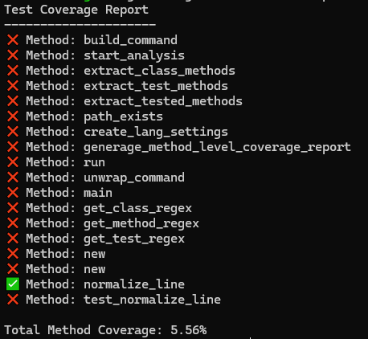

# coverme

An open source local code coverage analyzer tool written in Rust.

# Crates.io

You can always find the latest version of the crate here: https://crates.io/crates/coverme

# Install

To install, you can run `cargo install coverme`

You are also welcome to pull the repo and run via `cargo run -- --repo your_repo_path --language language`

## CLI Options

- --repo <PATH>
  - pass the directory you want to run the analysis on
- --language <Language>
  - pass the language that the code being tested is written in
    - "rust"
    - "csharp"

## Current Language Support

- Rust
- C# (still in verification testing)

### Languages In The Works

- Python
- Go
- JavaScript

## Example output

Currently, we are only reporting at the method level. Here is an example output from running coverall on its own repo with only one test written.

# Contributing and Ideas

Feel free to open an issue on GitHub with any ideas you have on how we can improve coverme. These are all subject to review and approval before being allowed.

If you would like to help build coverme, create a feature branch off of `main` and submit a PR. If the PR meets the standards and goals of this project, I will approve it and merge it in.

testing branch rules
